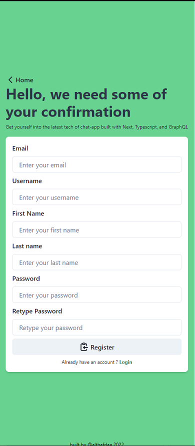

# Fullstack Realtime Chatting App GraphQL

Clone the repository
Open up terminal with the repository local directory

```
npm install
```

```
npm run dev
```

# About The Project

**LIVE:** [https://chatsql.vercel.app/](https://chatsql.vercel.app/)

This is my personal project solely to keep myself updated with the current technologies especially in the Frontend. Most of the stack here is something that i barely use. With this project i am trying to learn Typescript and GraphQL by building my own backend. This is a realtime chatting app mimicking real world application.
<br />
<br />
Chats/Communication feature is a feature that most of us use from daily basis, corporate customer service, and whole chat app like Whatsapp or Discord, this is al so my first step and i learned **ALOT** about GraphQL and Typescript.
<br />
<br />
GraphQL is something that i think i will master soon since so many people talked about and bunch of company used! Such as google even though GraphQL is founded and maintained by Facebook/Meta one of their big tech competitor use it as one of their stack, that could only mean there's something amazing in GraphQL.
<br />
<br />
Also after working as Software Engineer myself i started to understand why GraphQL is so popular.

The project itself is bootstrapped by [Create T3 App](https://github.com/t3-oss/create-t3-app)

```
npx install create-t3-app
```

## Screenshot & Preview

[Video Preview Click Here](https://user-images.githubusercontent.com/92288572/189355163-90afa054-39f1-4353-a5e8-576ca5b44098.mp4)
<br/>
<br/>





## Builth With

### The Base

Bootstrapped with create-t3-app

- [Typescript](https://www.typescriptlang.org/)
- [NextJs](https://nextjs.org/)
- [GraphQL](https://graphql.org/)

### Server Side

- [Apollo](https://www.apollographql.com/docs/)
- [Postgres SQL](https://www.postgresql.org/)
- [Prisma ORM](https://www.prisma.io/)
- [GraphQL Nexus](https://nexusjs.org/)
- [Railway](https://railway.app/) to host the database
- [Vercel](https://vercel.com/dashboard) to host the repo

### The CSS Component

- [Chakra UI](https://chakra-ui.com/)

### The Supporter

- [Yup](https://github.com/jquense/yup) - my go to object schema validation
- [nookies](https://github.com/maticzav/nookies) - the best library that helped NextJs handle cookies and token from Frontend to Backend

## Feature

- Login/Register Feature
- Update Profile
- Change Password
- SSR Protected routes
- Follow/Unfollow features
- Searching for other people by username
- Realtime chatting with difference users

## What I Learned

Backend development is hard but is also interesting, the way i need to think a lot about table/database relationship and how these data is interacting with each other really take my time learning about SQL.
<br />
<br />
I am always thinking that its impossible for me to do backend code but its actually kinda fun and i enjoyed it especially with GraphQL and Typescript i think my learning curve is way steeper. I haven't met with crazy custom SQL language so Prisma pretty much handle evertyhing for me. Also typesafety coming from all these package (Typescript, Prisma, GraphQL Nexus) giving so much better DX and helped me a lot with the development even tho i am pretty slow.
<br />
<br />
My next i will do GrahpQL again but with Express/Nodejs. i will try to differentiate the repo between backend and Frontend!
